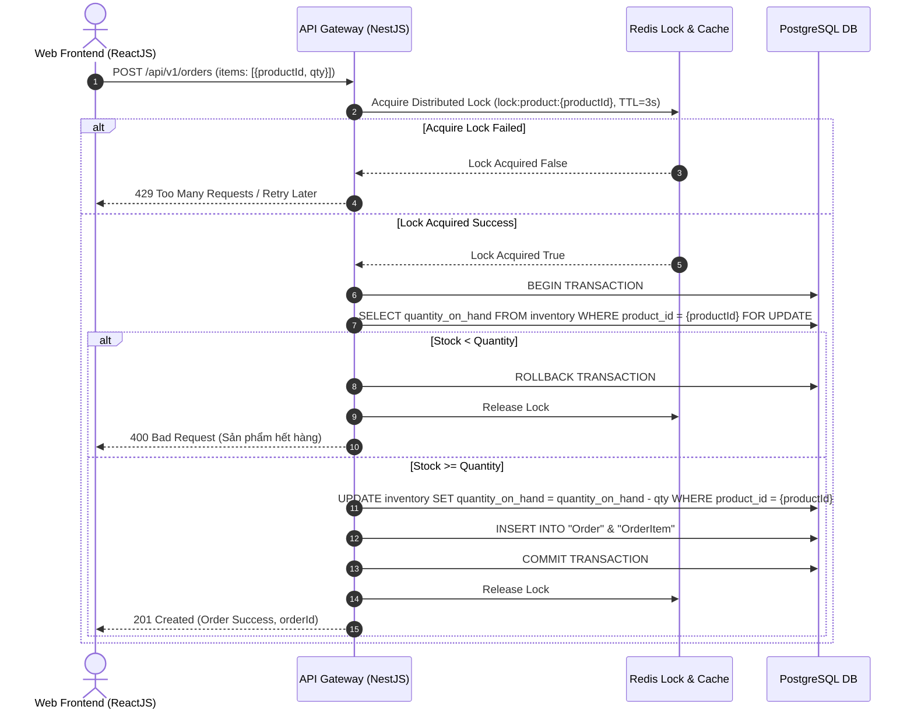
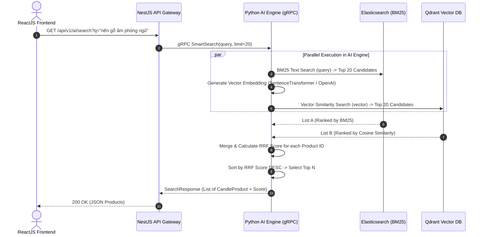
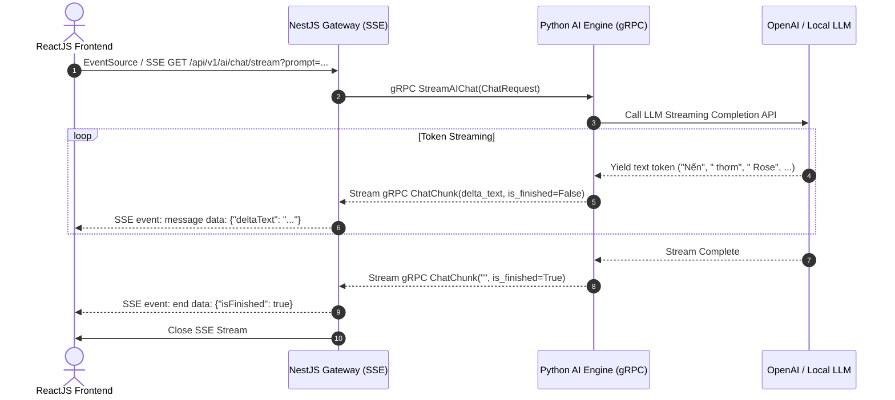
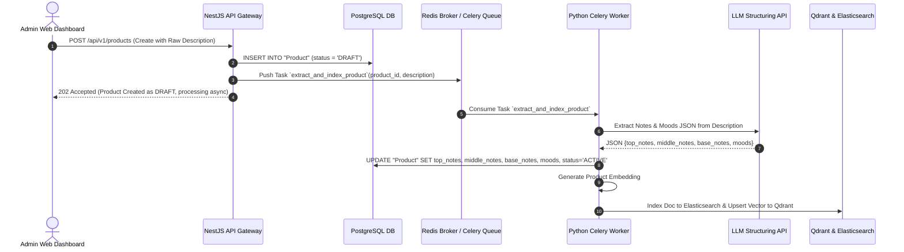
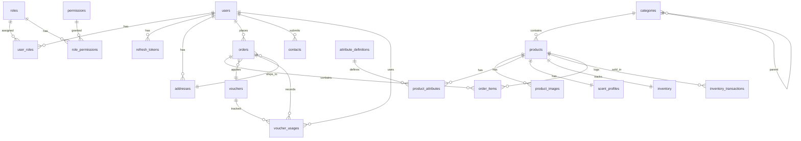

# AuraScent - Tài liệu Phân tích Kiến trúc BMAD & Technical Roadmap

> **Dự án:** AuraScent - E-Commerce Nến Thơm Cao Cấp Tích Hợp AI Tư Vấn Mùi Hương Real-time  
> **Tác giả:** Principal Solutions Architect & Technical Lead  
> **Phương pháp luận:** BMAD Framework (Business - Method - Architecture - Data)  
> **Ngày cập nhật:** 21/08/2026  

---

## 📋 MỤC LỤC
1. [B - BUSINESS (Bài toán & Giá trị Kinh doanh)](#1-b---business-bài-toán--giá-trị-kinh-doanh)
2. [M - METHOD (Phương pháp & Luồng Nghiệp vụ)](#2-m---method-phương-pháp--luồng-nghiệp-vụ)
3. [A - ARCHITECTURE (Kiến trúc Hệ thống & Module Detail)](#3-a---architecture-kiến-trúc-hệ-thống--module-detail)
4. [D - DATA (Mô hình Dữ liệu & Storage)](#4-d---data-mô-hình-dữ-liệu--storage)
5. [🚀 ACTIONABLE TECHNICAL ROADMAP (Phát triển 4 Phase)](#5--actionable-technical-roadmap-phát-triển-4-phase)

---

## 1. B - BUSINESS (Bài toán & Giá trị Kinh doanh)

### 1.1. User Persona & Pain Points
* **Target Audience (Gen Z & Millennials, Decor Enthusiasts, Stress Relievers, Gift Shoppers):**
  * **Persona 1 - Scent Explorer (Người tìm kiếm trải nghiệm):** Yêu thích thử nghiệm mùi hương mới theo tâm trạng (thư giãn, tập trung làm việc, tạo không gian ấm cúng khi đọc sách), coi nến thơm là một phần của lối sống (lifestyle).
  * **Persona 2 - Gift Finder (Người mua quà tặng):** Tìm kiếm nến thơm cao cấp làm quà tặng tinh tế cho người thân, đối tác nhưng phân vân không biết hương thơm nào phù hợp với cá tính người nhận.
* **Pain Points khi mua nến thơm Online:**
  1. **Không thể trải nghiệm khứu giác trực tiếp (Smell Barrier):** Chỉ xem qua hình ảnh và chữ mô tả đơn điệu, khó hình dung sự hòa quyện giữa các tầng hương (*Top Notes*, *Middle Notes*, *Base Notes*).
  2. **Khó chọn mùi theo Ngữ cảnh/Cảm xúc (Contextual Ambiguity):** Từ khóa tìm kiếm truyền thống (VD: "nến hoa hồng") không đáp ứng được nhu cầu tìm theo cảm xúc hay không gian (VD: "mùi gỗ ấm cúng cho phòng ngủ mùa đông", "mùi thanh mát xả stress sau giờ làm").
  3. **Rủi ro Over-selling / Hết hàng giả tạo khi Flash Sale:** Khi săn các phiên bản giới hạn (Limited Edition), hệ thống thường bị đơ hoặc báo mua thành công nhưng sau đó hủy đơn do quá tải tồn kho.

### 1.2. Giá trị Kinh doanh từ Lớp AI (AI Business Value)
* **AI Scent Consultant (Tư vấn viên mùi hương AI 24/7):**
  * Trò chuyện tự nhiên, giải mã nhu cầu cảm xúc & không gian của khách hàng thành gợi ý sản phẩm chính xác.
  * Tăng tỉ lệ chuyển đổi (**Conversion Rate +25-35%**) và giảm tỉ lệ đổi trả do chọn sai mùi hương.
* **Smart Hybrid Search (Tìm kiếm Lai ghép thông minh):**
  * Kết hợp **BM25 Keyword Matching** (từ khóa chính xác như tên thương hiệu, tên mùi) và **Qdrant Vector Similarity** (hiểu ý định ngữ nghĩa, tâm trạng).
  * Giảm tỉ lệ tìm kiếm không ra kết quả (*Zero-result search drop to <1%*).
* **Async Automated Metadata Extraction (Chuẩn hóa dữ liệu tự động):**
  * Bóc tách chính xác các tầng hương (*Top/Middle/Base Notes*) và sắc thái cảm xúc (*Moods*) từ văn bản mô tả thô của Admin bằng Celery Worker.
  * Tiết kiệm 90% thời gian nhập liệu manual cho đội ngũ Vận hành (Operations).

### 1.3. Liệt kê Yêu cầu Chức năng & Phi Chức năng

#### 🎯 Functional Requirements (FR)
* **FR-01 (E-commerce Core):** Đăng ký/Đăng nhập (JWT), Xem danh mục sản phẩm, Quản lý giỏ hàng, Đặt hàng và theo dõi đơn hàng.
* **FR-02 (Anti-Overselling Inventory):** Đặt hàng đồng thời với cơ chế khóa phân tán Redis Lock + PostgreSQL ACID Transaction để trừ kho chính xác 100%.
* **FR-03 (Smart Hybrid Search):** Tìm kiếm kết hợp full-text search và ngữ nghĩa vector với thuật toán Reciprocal Rank Fusion (RRF).
* **FR-04 (Real-time AI Chatbot):** Tư vấn tư duy khứu giác dạng dòng văn bản liên tục (Server-Sent Events streaming).
* **FR-05 (Async Metadata Pipeline):** Tự động phân tích bài viết mô tả nến thơm, trích xuất cấu trúc tầng hương khi Admin thêm sản phẩm mới.

#### ⚡ Non-Functional Requirements (NFR)
* **NFR-01 (SLA Latency):**
  * Hybrid Search response time: $< 200ms$.
  * AI Chatbot Time-to-First-Token (TTFT): $< 500ms$.
  * Order Creation throughput latency: $< 300ms$ cho $99\%$ requests (P99).
* **NFR-02 (Concurrency & Throughput):**
  * Khả năng chịu tải đạt $1.000+$ TPS (Transactions Per Second) tại endpoint Checkout trong các đợt Flash Sale.
* **NFR-03 (Data Integrity & Resilience):**
  * **Zero Over-selling guarantee:** Kho không bao giờ bị âm dưới mọi tải trọng concurrency.
  * **Eventual Consistency:** Dữ liệu sản phẩm từ PostgreSQL đồng bộ sang Elasticsearch và Qdrant trong vòng $< 2$ giây.
  * **Circuit Breaker:** Khi AI Engine gặp sự cố, Search tự động fallback về PostgreSQL Full-text Search mà không gây nghẽn toàn bộ hệ thống.

---

## 2. M - METHOD (Phương pháp & Luồng Nghiệp vụ)

### 2.1. Luồng Xử lý Đơn hàng (Order Placement) - Anti-Overselling Workflow

Cơ chế kết hợp **Redis Distributed Lock (Redlock)** ở tầng API Gateway để Serialize các request trùng sản phẩm hot, kết hợp **PostgreSQL Row-level Lock (`SELECT FOR UPDATE`)** trong Database Transaction.



---

### 2.2. Luồng Tìm kiếm Thông minh (Smart Hybrid Search Workflow with RRF)

Kết hợp điểm số từ **Elasticsearch (BM25)** và **Qdrant (Cosine Similarity Vector)** thông qua thuật toán **Reciprocal Rank Fusion (RRF)**.

Formula:
$$RRF\_Score(d) = \frac{1}{k + r_{ES}(d)} + \frac{1}{k + r_{Qdrant}(d)} \quad (với\ k = 60)$$



---

### 2.3. Luồng Streaming Chatbot (Real-time AI Consultant Workflow)

Luồng giao tiếp đa tầng: **gRPC Server Streaming (Python AI Engine $\rightarrow$ NestJS Gateway)** kết hợp với **Server-Sent Events - SSE (NestJS Gateway $\rightarrow$ ReactJS Frontend)**.



---

### 2.4. Luồng Async Metadata Extraction (Celery Worker Workflow)

Khi Admin tạo sản phẩm mới, công việc bóc tách thuộc tính tầng hương được đẩy vào hàng đợi Async Celery để không làm block HTTP Request của Admin.



---

## 3. A - ARCHITECTURE (Kiến trúc Hệ thống & Module Detail)

### 3.1. Sơ đồ Tổng quan Kiến trúc (Monorepo System Architecture)

```
+-----------------------------------------------------------------------------------+
|                                   WEB FRONTEND                                    |
|                             ReactJS + TypeScript (Vite)                           |
+-----------------------------------------------------------------------------------+
                                         | REST / SSE (HTTP/2)
                                         v
+-----------------------------------------------------------------------------------+
|                                NESTJS API GATEWAY                                 |
|  +----------------+  +-----------------+  +----------------+  +-----------------+  |
|  |   AuthModule   |  | ProductsModule  |  |  OrdersModule  |  | AiClientModule  |  |
|  +----------------+  +-----------------+  +----------------+  +-----------------+  |
|         |                     |                   |                    |          |
|    JWT / Passport       TypeORM            Redlock / TypeORM     gRPC Client     |
+---------|---------------------|-------------------|--------------------|----------+
          |                     |                   |                    |
          |                     v                   v                    | gRPC
          |        +----------------------------------------+            | Protobuf
          +------->|         PostgreSQL Database            |<-----------+
                   +----------------------------------------+            |
                                                            |            |
                                                            v            v
+-----------------------------------------------------------------------------------+
|                                 PYTHON AI ENGINE                                  |
|  +-------------------------------------+  +------------------------------------+  |
|  |     gRPC Server (Servicer)          |  |       Celery Async Engine          |  |
|  | - StreamAIChat                      |  | - extract_product_metadata         |  |
|  | - SmartSearch (RRF Engine)          |  | - sync_postgres_to_vector_es       |  |
|  +-------------------------------------+  +------------------------------------+  |
+-----------------------------------------------------------------------------------+
          |                                   |                    |
          v                                   v                    v
+------------------+                +------------------+  +-------------------------+
|  Elasticsearch   |                |    Qdrant DB     |  |      Redis Broker       |
|  (BM25 Search)   |                |  (Vector DB)     |  | (Queue & Lock Storage)  |
+------------------+                +------------------+  +-------------------------+
```

---

### 3.2. NestJS API Gateway - Detailed Modules Design
* **`AuthModule`**: Đăng ký, Đăng nhập, Guard JWT, Refreshtoken, RBAC (`ADMIN`, `CUSTOMER`).
* **`ProductsModule`**:
  * Public APIs: Lấy danh sách sản phẩm (cache trên Redis), Xem chi tiết sản phẩm.
  * Admin APIs: Tạo/Sửa/Xóa sản phẩm, Trigger Re-index metadata.
* **`OrdersModule`**:
  * Tích hợp `RedlockService` để tạo khóa phân tán theo `product_id`.
  * Thực thi DB Transaction qua TypeORM `DataSource.transaction()` + `SELECT FOR UPDATE` (QueryRunner).
* **`AiClientModule`**:
  * Khởi tạo `GrpcClient` kết nối tới `ai-engine:50051`.
  * Expose Endpoint SSE Controller `/api/v1/ai/chat/stream` nhận `Observable<ChatChunk>` từ gRPC và pipe sang client format `MessageEvent`.
  * Proxy endpoint `/api/v1/ai/search` gọi gRPC `SmartSearch`.

---

### 3.3. Python AI Engine - Detailed Modules Design
* **`grpc_server/`**:
  * Thực thi `ScentedCandlesAIServiceServicer` được sinh ra từ `scented-candles.proto`.
  * `StreamAIChat`: Quản lý prompt context, gọi LLM Stream (OpenAI / LangChain), `yield ChatChunk`.
  * `SmartSearch`: Đọc query $\rightarrow$ Trích xuất embedding $\rightarrow$ Gọi song song ES & Qdrant $\rightarrow$ Tính RRF Rank $\rightarrow$ Trả về kết quả.
* **`search_engine/`**:
  * `es_client.py`: Quản lý query BM25 trên Elasticsearch.
  * `qdrant_client.py`: Quản lý tìm kiếm Similarity Vector trên Qdrant collection.
  * `rrf_fusion.py`: Thuật toán hợp nhất kết quả RRF.
* **`celery_engine/`**:
  * `tasks.py`: Celery Task `async_extract_metadata(product_id, description)` dùng Instructor / LangChain Structured Output để ép LLM trả về đúng Pydantic Schema.
* **`embedding_service/`**:
  * Sinh vector embedding bằng model `sentence-transformers/all-MiniLM-L6-v2` (384 dimensions) hoặc `text-embedding-3-small` (1536 dimensions).

---

### 3.4. Bộ API Contracts Spec

#### A. RESTful Endpoints (NestJS API Gateway)
| HTTP Method | Path | Auth Required | Mô tả |
| :--- | :--- | :--- | :--- |
| `POST` | `/api/v1/auth/register` | No | Đăng ký tài khoản mới |
| `POST` | `/api/v1/auth/login` | No | Đăng nhập nhận JWT Token |
| `GET` | `/api/v1/products` | No | Lấy danh sách sản phẩm (có Pagination & Cache) |
| `GET` | `/api/v1/products/:id` | No | Xem chi tiết sản phẩm |
| `POST` | `/api/v1/products` | Yes (Admin) | Tạo sản phẩm mới (Kích hoạt Celery Worker) |
| `POST` | `/api/v1/orders` | Yes (Customer) | Đặt hàng (Khóa Redis & Trừ kho Atomic) |
| `GET` | `/api/v1/ai/search` | No | Smart Hybrid Search |
| `GET` | `/api/v1/ai/chat/stream` | No/Yes | Real-time SSE Chatbot Stream |

#### B. gRPC Spec (`scented-candles.proto`)
*(Đã được định nghĩa chuẩn xác tại `packages/scented-candles.proto`)*:
- Service: `scented_candles.ai.v1.ScentedCandlesAIService`
- Methods:
  1. `rpc StreamAIChat (ChatRequest) returns (stream ChatChunk);`
  2. `rpc SmartSearch (SearchQuery) returns (SearchResponse);`
  3. `rpc ExtractCandleMetadata (ExtractRequest) returns (ExtractResponse);`

---

### 3.5. Caching Strategy & Circuit Breaker / Retry Policy
* **Caching Strategy (Redis):**
  * **Product Detail Cache:** `product:detail:{id}` (TTL: 1 hour, Invalidate khi Admin Update).
  * **Hot Search Cache:** `search:cache:{md5(query)}` (TTL: 15 mins).
  * **Distributed Lock Key:** `lock:product:{productId}` (TTL: 3 seconds).
* **Retry Policy & Circuit Breaker (NestJS API Gateway $\rightarrow$ Python AI Engine):**
  * Tích hợp **Resilience4j / Cockatiel / RxJS retryWhen** cho gRPC client.
  * Retry tối đa 3 lần với **Exponential Backoff** ($100ms, 200ms, 400ms$).
  * **Circuit Breaker:** Khi tỉ lệ lỗi gRPC $> 50\%$ trong 10 giây $\rightarrow$ Open Circuit $\rightarrow$ Chuyển luồng Search sang PostgreSQL ILIKE / Full-text Search fallback; Chatbot trả về phản hồi tĩnh tạm thời.

---

## 4. D - DATA (Mô hình Dữ liệu & Storage)

### 4.1. PostgreSQL Database Schema (TypeORM Entities)

> **ORM:** TypeORM + PostgreSQL 16  
> **Convention:** `snake_case` cho column DB, `camelCase` trong entity TypeScript  
> **Audit:** Mọi bảng nghiệp vụ kế thừa `created_at`, `updated_at`, `deleted_at` (soft delete)  
> **Tiền tệ:** `DECIMAL(12, 2)` — không dùng `float`  
> **ID:** `UUID` (`gen_random_uuid()`)

#### 4.1.1. Danh sách bảng & nhóm chức năng

| Nhóm | Bảng | Mô tả |
| :--- | :--- | :--- |
| **IAM / RBAC** | `users`, `roles`, `permissions`, `user_roles`, `role_permissions`, `refresh_tokens` | Tài khoản, phân quyền chi tiết |
| **Catalog** | `categories`, `products`, `product_images`, `attribute_definitions`, `product_attributes`, `scent_profiles` | Danh mục, sản phẩm, thuộc tính, hồ sơ mùi hương (AI) |
| **Inventory** | `inventory`, `inventory_transactions` | Tồn kho tách riêng + audit log (chống over-selling) |
| **Order** | `orders`, `order_items`, `addresses` | Đơn hàng, chi tiết, địa chỉ giao hàng |
| **Promotion** | `vouchers`, `voucher_usages` | Mã giảm giá & lịch sử dùng |
| **CRM** | `contacts` | Liên hệ / hỗ trợ khách hàng |



---

#### 4.1.2. Enums

| Enum | Giá trị | Dùng cho |
| :--- | :--- | :--- |
| `ProductStatus` | `DRAFT`, `PROCESSING`, `ACTIVE`, `INACTIVE` | `products.status` |
| `OrderStatus` | `PENDING`, `PROCESSING`, `SHIPPED`, `DELIVERED`, `CANCELLED`, `REFUNDED` | `orders.status` |
| `PaymentStatus` | `PENDING`, `PAID`, `FAILED`, `REFUNDED` | `orders.payment_status` |
| `PaymentMethod` | `COD`, `BANK_TRANSFER`, `CARD`, `E_WALLET` | `orders.payment_method` |
| `VoucherType` | `PERCENT`, `FIXED_AMOUNT` | `vouchers.type` |
| `VoucherStatus` | `ACTIVE`, `INACTIVE`, `EXPIRED` | `vouchers.status` |
| `AttributeInputType` | `TEXT`, `NUMBER`, `BOOLEAN`, `SINGLE_SELECT`, `MULTI_SELECT` | `attribute_definitions.input_type` |
| `AttributeGroup` | `SCENT`, `PHYSICAL`, `MERCHANDISING` | `attribute_definitions.group` |
| `ExtractionStatus` | `PENDING`, `COMPLETED`, `FAILED` | `scent_profiles.extraction_status` |
| `InventoryTransactionType` | `ORDER`, `RETURN`, `ADJUSTMENT`, `RESERVE`, `RELEASE` | `inventory_transactions.type` |
| `ContactType` | `GENERAL`, `SUPPORT`, `PARTNER`, `FEEDBACK` | `contacts.type` |
| `ContactStatus` | `NEW`, `IN_PROGRESS`, `RESOLVED`, `CLOSED` | `contacts.status` |

---

#### 4.1.3. IAM — Users, Roles & Permissions

##### `users`

| Field | Type | Constraints | Mô tả |
| :--- | :--- | :--- | :--- |
| `id` | `UUID` | PK | |
| `email` | `VARCHAR(255)` | UNIQUE, NOT NULL | Email đăng nhập |
| `password_hash` | `VARCHAR(255)` | NOT NULL | Bcrypt hash |
| `full_name` | `VARCHAR(150)` | NOT NULL | |
| `phone` | `VARCHAR(20)` | NULL | SĐT (tuỳ chọn) |
| `avatar_url` | `VARCHAR(500)` | NULL | Ảnh đại diện |
| `is_active` | `BOOLEAN` | DEFAULT `true` | Khóa tài khoản |
| `email_verified_at` | `TIMESTAMPTZ` | NULL | Xác thực email |
| `last_login_at` | `TIMESTAMPTZ` | NULL | Lần login cuối |
| `created_at` | `TIMESTAMPTZ` | NOT NULL | |
| `updated_at` | `TIMESTAMPTZ` | NOT NULL | |
| `deleted_at` | `TIMESTAMPTZ` | NULL | Soft delete |

**Index:** `email`

##### `roles`

| Field | Type | Constraints | Mô tả |
| :--- | :--- | :--- | :--- |
| `id` | `UUID` | PK | |
| `code` | `VARCHAR(50)` | UNIQUE, NOT NULL | `ADMIN`, `CUSTOMER`, `STAFF` |
| `name` | `VARCHAR(100)` | NOT NULL | Tên hiển thị |
| `description` | `TEXT` | NULL | |
| `is_system` | `BOOLEAN` | DEFAULT `false` | Role hệ thống — không xóa |
| `created_at` | `TIMESTAMPTZ` | NOT NULL | |
| `updated_at` | `TIMESTAMPTZ` | NOT NULL | |

**Seed mặc định:** `ADMIN`, `CUSTOMER`, `STAFF`

##### `permissions`

| Field | Type | Constraints | Mô tả |
| :--- | :--- | :--- | :--- |
| `id` | `UUID` | PK | |
| `code` | `VARCHAR(100)` | UNIQUE, NOT NULL | `products.create`, `orders.read` |
| `resource` | `VARCHAR(50)` | NOT NULL | `products`, `orders`, `vouchers` |
| `action` | `VARCHAR(50)` | NOT NULL | `create`, `read`, `update`, `delete` |
| `description` | `TEXT` | NULL | |
| `created_at` | `TIMESTAMPTZ` | NOT NULL | |

##### `user_roles` (junction)

| Field | Type | Constraints | Mô tả |
| :--- | :--- | :--- | :--- |
| `user_id` | `UUID` | FK → `users.id`, PK | |
| `role_id` | `UUID` | FK → `roles.id`, PK | |
| `assigned_at` | `TIMESTAMPTZ` | NOT NULL | Thời điểm gán role |

##### `role_permissions` (junction)

| Field | Type | Constraints | Mô tả |
| :--- | :--- | :--- | :--- |
| `role_id` | `UUID` | FK → `roles.id`, PK | |
| `permission_id` | `UUID` | FK → `permissions.id`, PK | |

##### `refresh_tokens`

| Field | Type | Constraints | Mô tả |
| :--- | :--- | :--- | :--- |
| `id` | `UUID` | PK | |
| `user_id` | `UUID` | FK → `users.id`, NOT NULL | |
| `token_hash` | `VARCHAR(255)` | NOT NULL | Hash refresh token |
| `expires_at` | `TIMESTAMPTZ` | NOT NULL | |
| `revoked_at` | `TIMESTAMPTZ` | NULL | Revoke khi logout |
| `created_at` | `TIMESTAMPTZ` | NOT NULL | |

**Index:** `user_id`, `token_hash`

---

#### 4.1.4. Catalog — Categories, Products & Attributes

##### `categories`

| Field | Type | Constraints | Mô tả |
| :--- | :--- | :--- | :--- |
| `id` | `UUID` | PK | |
| `parent_id` | `UUID` | FK → `categories.id`, NULL | Danh mục cha (cây) |
| `name` | `VARCHAR(150)` | NOT NULL | |
| `slug` | `VARCHAR(150)` | UNIQUE, NOT NULL | URL-friendly |
| `description` | `TEXT` | NULL | |
| `image_url` | `VARCHAR(500)` | NULL | Ảnh banner danh mục |
| `sort_order` | `INT` | DEFAULT `0` | Thứ tự hiển thị |
| `is_active` | `BOOLEAN` | DEFAULT `true` | |
| `created_at` | `TIMESTAMPTZ` | NOT NULL | |
| `updated_at` | `TIMESTAMPTZ` | NOT NULL | |
| `deleted_at` | `TIMESTAMPTZ` | NULL | |

**Index:** `parent_id`, `slug`

##### `products`

| Field | Type | Constraints | Mô tả |
| :--- | :--- | :--- | :--- |
| `id` | `UUID` | PK | |
| `category_id` | `UUID` | FK → `categories.id`, NOT NULL | |
| `sku` | `VARCHAR(50)` | UNIQUE, NOT NULL | Mã SKU nội bộ |
| `name` | `VARCHAR(255)` | NOT NULL | Tên sản phẩm |
| `slug` | `VARCHAR(255)` | UNIQUE, NOT NULL | |
| `short_description` | `VARCHAR(500)` | NULL | Mô tả ngắn (listing) |
| `raw_description` | `TEXT` | NOT NULL | Mô tả thô — input cho AI extract |
| `price` | `DECIMAL(12,2)` | NOT NULL | Giá bán |
| `compare_at_price` | `DECIMAL(12,2)` | NULL | Giá gốc (gạch ngang) |
| `status` | `ProductStatus` | DEFAULT `DRAFT` | |
| `is_featured` | `BOOLEAN` | DEFAULT `false` | Nổi bật / homepage |
| `weight_grams` | `INT` | NULL | Trọng lượng (gram) |
| `burn_time_hours` | `DECIMAL(5,1)` | NULL | Thời gian cháy (giờ) |
| `created_at` | `TIMESTAMPTZ` | NOT NULL | |
| `updated_at` | `TIMESTAMPTZ` | NOT NULL | |
| `deleted_at` | `TIMESTAMPTZ` | NULL | |

**Index:** `category_id`, `status`, `sku`, `slug`

> **Lưu ý:** Không lưu `stock` trên `products` — tách sang bảng `inventory`.

##### `product_images`

| Field | Type | Constraints | Mô tả |
| :--- | :--- | :--- | :--- |
| `id` | `UUID` | PK | |
| `product_id` | `UUID` | FK → `products.id`, NOT NULL | |
| `url` | `VARCHAR(500)` | NOT NULL | URL ảnh (MinIO/S3) |
| `alt_text` | `VARCHAR(255)` | NULL | SEO / accessibility |
| `sort_order` | `INT` | DEFAULT `0` | Thứ tự gallery |
| `is_primary` | `BOOLEAN` | DEFAULT `false` | Ảnh đại diện |
| `created_at` | `TIMESTAMPTZ` | NOT NULL | |

**Index:** `product_id`

##### `attribute_definitions` (định nghĩa thuộc tính sản phẩm)

| Field | Type | Constraints | Mô tả |
| :--- | :--- | :--- | :--- |
| `id` | `UUID` | PK | |
| `code` | `VARCHAR(50)` | UNIQUE, NOT NULL | `wax_type`, `jar_color`, `size` |
| `name` | `VARCHAR(100)` | NOT NULL | Tên hiển thị |
| `group` | `AttributeGroup` | NOT NULL | `SCENT`, `PHYSICAL`, `MERCHANDISING` |
| `input_type` | `AttributeInputType` | NOT NULL | Kiểu nhập liệu |
| `options` | `JSONB` | NULL | Danh sách option cho SELECT |
| `is_filterable` | `BOOLEAN` | DEFAULT `false` | Hiện trong bộ lọc search |
| `is_required` | `BOOLEAN` | DEFAULT `false` | Bắt buộc khi tạo SP |
| `sort_order` | `INT` | DEFAULT `0` | |
| `created_at` | `TIMESTAMPTZ` | NOT NULL | |
| `updated_at` | `TIMESTAMPTZ` | NOT NULL | |

**Seed gợi ý:** `wax_type`, `jar_color`, `jar_size`, `wick_type`, `is_handmade`

##### `product_attributes` (giá trị thuộc tính theo sản phẩm)

| Field | Type | Constraints | Mô tả |
| :--- | :--- | :--- | :--- |
| `id` | `UUID` | PK | |
| `product_id` | `UUID` | FK → `products.id`, NOT NULL | |
| `attribute_definition_id` | `UUID` | FK → `attribute_definitions.id`, NOT NULL | |
| `value_text` | `VARCHAR(500)` | NULL | Giá trị text / single select |
| `value_number` | `DECIMAL(12,2)` | NULL | Giá trị số |
| `value_json` | `JSONB` | NULL | Multi-select hoặc cấu trúc phức |
| `created_at` | `TIMESTAMPTZ` | NOT NULL | |
| `updated_at` | `TIMESTAMPTZ` | NOT NULL | |

**Unique:** `(product_id, attribute_definition_id)`

##### `scent_profiles` (hồ sơ mùi hương — phục vụ AI Search & Chatbot)

| Field | Type | Constraints | Mô tả |
| :--- | :--- | :--- | :--- |
| `id` | `UUID` | PK | |
| `product_id` | `UUID` | FK → `products.id`, UNIQUE, NOT NULL | 1 SP = 1 profile |
| `top_notes` | `TEXT[]` | DEFAULT `{}` | Hương đầu |
| `middle_notes` | `TEXT[]` | DEFAULT `{}` | Hương giữa |
| `base_notes` | `TEXT[]` | DEFAULT `{}` | Hương cuối |
| `moods` | `TEXT[]` | DEFAULT `{}` | Cảm xúc / không gian |
| `ai_summary` | `TEXT` | NULL | Tóm tắt do LLM sinh (cho embedding) |
| `extraction_status` | `ExtractionStatus` | DEFAULT `PENDING` | Trạng thái Celery extract |
| `extracted_at` | `TIMESTAMPTZ` | NULL | |
| `created_at` | `TIMESTAMPTZ` | NOT NULL | |
| `updated_at` | `TIMESTAMPTZ` | NOT NULL | |

> Celery Worker cập nhật bảng này sau khi gọi gRPC `ExtractCandleMetadata`. Dữ liệu đồng bộ sang ES/Qdrant từ đây.

---

#### 4.1.5. Inventory — Tồn kho & Audit

##### `inventory`

| Field | Type | Constraints | Mô tả |
| :--- | :--- | :--- | :--- |
| `id` | `UUID` | PK | |
| `product_id` | `UUID` | FK → `products.id`, UNIQUE, NOT NULL | 1 SP = 1 dòng tồn |
| `quantity_on_hand` | `INT` | DEFAULT `0`, NOT NULL | Tồn thực tế |
| `quantity_reserved` | `INT` | DEFAULT `0`, NOT NULL | Đang giữ (checkout) |
| `low_stock_threshold` | `INT` | DEFAULT `5` | Cảnh báo sắp hết |
| `updated_at` | `TIMESTAMPTZ` | NOT NULL | |

**Công thức:** `quantity_available = quantity_on_hand - quantity_reserved`

> Checkout flow: `RESERVE` → trừ `on_hand` khi `COMMIT` order, hoặc `RELEASE` khi hủy.

##### `inventory_transactions` (audit log — bắt buộc cho debug over-selling)

| Field | Type | Constraints | Mô tả |
| :--- | :--- | :--- | :--- |
| `id` | `UUID` | PK | |
| `product_id` | `UUID` | FK → `products.id`, NOT NULL | |
| `type` | `InventoryTransactionType` | NOT NULL | `ORDER`, `RETURN`, `ADJUSTMENT`, `RESERVE`, `RELEASE` |
| `quantity_change` | `INT` | NOT NULL | Dương = nhập, âm = xuất |
| `quantity_after` | `INT` | NOT NULL | Tồn sau giao dịch |
| `reference_type` | `VARCHAR(50)` | NULL | `order`, `manual` |
| `reference_id` | `UUID` | NULL | ID đơn hàng / phiếu |
| `note` | `TEXT` | NULL | Ghi chú admin |
| `created_by` | `UUID` | FK → `users.id`, NULL | Admin thao tác |
| `created_at` | `TIMESTAMPTZ` | NOT NULL | |

**Index:** `product_id`, `reference_id`, `created_at`

---

#### 4.1.6. Orders — Đơn hàng

##### `addresses`

| Field | Type | Constraints | Mô tả |
| :--- | :--- | :--- | :--- |
| `id` | `UUID` | PK | |
| `user_id` | `UUID` | FK → `users.id`, NOT NULL | |
| `label` | `VARCHAR(50)` | NULL | `Nhà`, `Công ty` |
| `recipient_name` | `VARCHAR(150)` | NOT NULL | |
| `phone` | `VARCHAR(20)` | NOT NULL | |
| `address_line_1` | `VARCHAR(255)` | NOT NULL | |
| `address_line_2` | `VARCHAR(255)` | NULL | |
| `city` | `VARCHAR(100)` | NOT NULL | Tỉnh/TP |
| `district` | `VARCHAR(100)` | NULL | Quận/Huyện |
| `ward` | `VARCHAR(100)` | NULL | Phường/Xã |
| `postal_code` | `VARCHAR(20)` | NULL | |
| `is_default` | `BOOLEAN` | DEFAULT `false` | Địa chỉ mặc định |
| `created_at` | `TIMESTAMPTZ` | NOT NULL | |
| `updated_at` | `TIMESTAMPTZ` | NOT NULL | |
| `deleted_at` | `TIMESTAMPTZ` | NULL | |

**Index:** `user_id`

##### `orders`

| Field | Type | Constraints | Mô tả |
| :--- | :--- | :--- | :--- |
| `id` | `UUID` | PK | |
| `order_number` | `VARCHAR(30)` | UNIQUE, NOT NULL | `ORD-2026-000001` |
| `user_id` | `UUID` | FK → `users.id`, NOT NULL | |
| `status` | `OrderStatus` | DEFAULT `PENDING` | |
| `payment_status` | `PaymentStatus` | DEFAULT `PENDING` | |
| `payment_method` | `PaymentMethod` | NULL | |
| `subtotal` | `DECIMAL(12,2)` | NOT NULL | Tổng trước giảm giá |
| `discount_amount` | `DECIMAL(12,2)` | DEFAULT `0` | Giảm từ voucher |
| `shipping_fee` | `DECIMAL(12,2)` | DEFAULT `0` | Phí ship |
| `total_amount` | `DECIMAL(12,2)` | NOT NULL | `subtotal - discount + shipping` |
| `voucher_id` | `UUID` | FK → `vouchers.id`, NULL | |
| `shipping_address_id` | `UUID` | FK → `addresses.id`, NULL | Snapshot địa chỉ |
| `notes` | `TEXT` | NULL | Ghi chú khách |
| `cancelled_at` | `TIMESTAMPTZ` | NULL | |
| `paid_at` | `TIMESTAMPTZ` | NULL | |
| `shipped_at` | `TIMESTAMPTZ` | NULL | |
| `delivered_at` | `TIMESTAMPTZ` | NULL | |
| `created_at` | `TIMESTAMPTZ` | NOT NULL | |
| `updated_at` | `TIMESTAMPTZ` | NOT NULL | |

**Index:** `user_id`, `order_number`, `status`, `created_at`

##### `order_items`

| Field | Type | Constraints | Mô tả |
| :--- | :--- | :--- | :--- |
| `id` | `UUID` | PK | |
| `order_id` | `UUID` | FK → `orders.id`, ON DELETE CASCADE | |
| `product_id` | `UUID` | FK → `products.id`, NOT NULL | |
| `product_name` | `VARCHAR(255)` | NOT NULL | Snapshot tên SP |
| `product_sku` | `VARCHAR(50)` | NOT NULL | Snapshot SKU |
| `quantity` | `INT` | NOT NULL, CHECK `> 0` | |
| `unit_price` | `DECIMAL(12,2)` | NOT NULL | Giá tại thời điểm mua |
| `line_total` | `DECIMAL(12,2)` | NOT NULL | `quantity × unit_price` |
| `created_at` | `TIMESTAMPTZ` | NOT NULL | |

**Index:** `order_id`, `product_id`

---

#### 4.1.7. Promotion — Vouchers

##### `vouchers`

| Field | Type | Constraints | Mô tả |
| :--- | :--- | :--- | :--- |
| `id` | `UUID` | PK | |
| `code` | `VARCHAR(50)` | UNIQUE, NOT NULL | `AURASCENT10` |
| `name` | `VARCHAR(150)` | NOT NULL | Tên chương trình |
| `description` | `TEXT` | NULL | |
| `type` | `VoucherType` | NOT NULL | `PERCENT` hoặc `FIXED_AMOUNT` |
| `value` | `DECIMAL(12,2)` | NOT NULL | % hoặc số tiền |
| `max_discount_amount` | `DECIMAL(12,2)` | NULL | Giới hạn giảm (cho PERCENT) |
| `min_order_amount` | `DECIMAL(12,2)` | NULL | Đơn tối thiểu |
| `usage_limit` | `INT` | NULL | Tổng lượt dùng toàn hệ thống |
| `usage_limit_per_user` | `INT` | NULL | Lượt dùng / user |
| `used_count` | `INT` | DEFAULT `0` | Đã dùng |
| `valid_from` | `TIMESTAMPTZ` | NOT NULL | |
| `valid_to` | `TIMESTAMPTZ` | NOT NULL | |
| `status` | `VoucherStatus` | DEFAULT `ACTIVE` | |
| `created_at` | `TIMESTAMPTZ` | NOT NULL | |
| `updated_at` | `TIMESTAMPTZ` | NOT NULL | |

**Index:** `code`, `status`, `valid_from`, `valid_to`

##### `voucher_usages`

| Field | Type | Constraints | Mô tả |
| :--- | :--- | :--- | :--- |
| `id` | `UUID` | PK | |
| `voucher_id` | `UUID` | FK → `vouchers.id`, NOT NULL | |
| `user_id` | `UUID` | FK → `users.id`, NOT NULL | |
| `order_id` | `UUID` | FK → `orders.id`, UNIQUE, NOT NULL | 1 voucher / đơn |
| `discount_amount` | `DECIMAL(12,2)` | NOT NULL | Số tiền thực giảm |
| `used_at` | `TIMESTAMPTZ` | NOT NULL | |

**Index:** `voucher_id`, `user_id`

---

#### 4.1.8. CRM — Contacts

##### `contacts`

| Field | Type | Constraints | Mô tả |
| :--- | :--- | :--- | :--- |
| `id` | `UUID` | PK | |
| `user_id` | `UUID` | FK → `users.id`, NULL | NULL = guest |
| `full_name` | `VARCHAR(150)` | NOT NULL | |
| `email` | `VARCHAR(255)` | NOT NULL | |
| `phone` | `VARCHAR(20)` | NULL | |
| `subject` | `VARCHAR(255)` | NOT NULL | |
| `message` | `TEXT` | NOT NULL | |
| `type` | `ContactType` | DEFAULT `GENERAL` | |
| `status` | `ContactStatus` | DEFAULT `NEW` | |
| `assigned_to` | `UUID` | FK → `users.id`, NULL | Admin xử lý |
| `replied_at` | `TIMESTAMPTZ` | NULL | |
| `created_at` | `TIMESTAMPTZ` | NOT NULL | |
| `updated_at` | `TIMESTAMPTZ` | NOT NULL | |

**Index:** `status`, `user_id`, `created_at`

---

#### 4.1.9. Gợi ý triển khai TypeORM (thứ tự migration)

```
Migration 1 — IAM:        roles, permissions, role_permissions, users, user_roles, refresh_tokens
Migration 2 — Catalog:    categories, products, product_images, attribute_definitions, product_attributes, scent_profiles
Migration 3 — Inventory:  inventory, inventory_transactions
Migration 4 — Order:      addresses, vouchers, orders, order_items, voucher_usages
Migration 5 — CRM:        contacts
Migration 6 — Seed:       roles, permissions, attribute_definitions
```

#### 4.1.10. Mapping sang TypeORM Entity (tham chiếu nhanh)

| Bảng DB | Entity file |
| :--- | :--- |
| `users` | `src/entities/user.entity.ts` |
| `roles` | `src/entities/role.entity.ts` |
| `permissions` | `src/entities/permission.entity.ts` |
| `categories` | `src/entities/category.entity.ts` |
| `products` | `src/entities/product.entity.ts` |
| `product_images` | `src/entities/product-image.entity.ts` |
| `attribute_definitions` | `src/entities/attribute-definition.entity.ts` |
| `product_attributes` | `src/entities/product-attribute.entity.ts` |
| `scent_profiles` | `src/entities/scent-profile.entity.ts` |
| `inventory` | `src/entities/inventory.entity.ts` |
| `inventory_transactions` | `src/entities/inventory-transaction.entity.ts` |
| `addresses` | `src/entities/address.entity.ts` |
| `orders` | `src/entities/order.entity.ts` |
| `order_items` | `src/entities/order-item.entity.ts` |
| `vouchers` | `src/entities/voucher.entity.ts` |
| `voucher_usages` | `src/entities/voucher-usage.entity.ts` |
| `contacts` | `src/entities/contact.entity.ts` |

---

### 4.2. Elasticsearch Index Schema Mapping (`scented_candles_products`)

```json
{
  "settings": {
    "number_of_shards": 1,
    "number_of_replicas": 0,
    "analysis": {
      "analyzer": {
        "vn_ngram_analyzer": {
          "type": "custom",
          "tokenizer": "standard",
          "filter": ["lowercase", "asciifolding", "ngram_filter"]
        }
      },
      "filter": {
        "ngram_filter": {
          "type": "edge_ngram",
          "min_gram": 2,
          "max_gram": 10
        }
      }
    }
  },
  "mappings": {
    "properties": {
      "id": { "type": "keyword" },
      "name": {
        "type": "text",
        "analyzer": "vn_ngram_analyzer",
        "search_analyzer": "standard"
      },
      "raw_description": { "type": "text" },
      "price": { "type": "double" },
      "stock": { "type": "integer" },
      "top_notes": { "type": "keyword" },
      "middle_notes": { "type": "keyword" },
      "base_notes": { "type": "keyword" },
      "moods": { "type": "keyword" },
      "is_active": { "type": "boolean" },
      "created_at": { "type": "date" }
    }
  }
}
```

---

### 4.3. Qdrant Vector Collection & Payload Schema

* **Collection Name:** `scented_candles_collection`
* **Vector Configuration:**
  * `size`: 384 (nếu dùng `sentence-transformers/all-MiniLM-L6-v2`) hoặc 1536 (`openai/text-embedding-3-small`).
  * `distance`: `Cosine`
* **Payload Attribute Structure:**

```json
{
  "product_id": "9b1deb4d-3b7d-4bad-9bdd-2b0d7b3dcb6d",
  "name": "Nến Thơm Đà Lạt Pine & Amber",
  "price": 350000.0,
  "category_id": "cat-001",
  "top_notes": ["Thông Đà Lạt", "Vỏ Chanh"],
  "middle_notes": ["Gỗ Thông", "Hổ Phách"],
  "base_notes": ["Rêu Phong", "Cỏ Hương Bài"],
  "moods": ["Ấm Cúng", "Thư Giãn", "Phòng Đọc Sách"],
  "is_active": true
}
```

---

### 4.4. Chiến lược Đồng bộ Dữ liệu (Data Sync Strategy)

Sử dụng **Transactional Outbox Pattern / Event-Driven Sync** qua Celery Queue:
1. Khi Product thay đổi trạng thái sang `ACTIVE` trên PostgreSQL $\rightarrow$ Phát sinh Event/Task `sync_product_to_search_engine(product_id)`.
2. Celery Worker đọc `products` + `scent_profiles` từ PostgreSQL.
3. Ghép chuỗi văn bản đại diện ngữ nghĩa:
   `text = f"{name}. Tầng hương đầu: {top_notes}. Tầng hương giữa: {middle_notes}. Tầng hương cuối: {base_notes}. Cảm xúc: {moods}. Mô tả: {raw_description}"`
4. Gọi Embedding Model để tạo vector từ `text`.
5. Đẩy Document sang Elasticsearch (`index`) và Qdrant (`upsert point`).
6. Đảm bảo tính nhất quán (Eventual Consistency) $< 2$ giây.

---

## 5. 🚀 ACTIONABLE TECHNICAL ROADMAP (Phát triển 4 Phase)

Dưới đây là Roadmap chi tiết các việc cần làm để khởi tạo và hoàn thiện dự án theo thứ tự chuẩn kỹ thuật.

### 📍 PHASE 1: Monorepo Foundation & Infrastructure Setup
> **Mục tiêu:** Dựng xong khung Monorepo, môi trường Docker Container và Protobuf RPC Spec.

- [ ] **Task 1.1:** Khởi tạo Monorepo cấu trúc chuẩn (`/app/web-fe`, `/app/api-gateway`, `/app/ai-engine`, `/packages/proto`).
- [ ] **Task 1.2:** Cấu hình `docker-compose.yml` chạy đủ các dịch vụ hạ tầng: PostgreSQL, Redis, Qdrant, Elasticsearch.
- [ ] **Task 1.3:** Đăng ký file Protobuf `packages/scented-candles.proto` cho 3 gRPC method (`StreamAIChat`, `SmartSearch`, `ExtractCandleMetadata`).
- [ ] **Task 1.4:** Thiết lập scripts tự động compile Protobuf thành TypeScript code (cho NestJS) và Python code (cho AI Engine).
- [ ] **Task 1.5:** Khởi tạo TypeORM Entities theo schema mục 4.1 & thực thi Migration đầu tiên trên PostgreSQL.

---

### 📍 PHASE 2: Core E-Commerce & Anti-Overselling Inventory
> **Mục tiêu:** Hoàn thiện toàn bộ logic E-commerce cốt lõi, Authentication và luồng Đặt hàng chống over-selling bằng Redis Distributed Lock.

- [ ] **Task 2.1:** Triển khai `AuthModule` (JWT Đăng ký, Đăng nhập, Guard phân quyền Admin/Customer).
- [ ] **Task 2.2:** Triển khai `ProductsModule` (CRUD Sản phẩm, Quản lý danh mục, Caching danh sách/chi tiết trên Redis).
- [ ] **Task 2.3:** Dựng `RedlockModule` trong NestJS sử dụng `ioredis` / `redlock` để tạo Distributed Lock.
- [ ] **Task 2.4:** Triển khai `OrdersModule` với DB Transaction (`SELECT FOR UPDATE`) + Redis Lock đảm bảo kho hàng không bao giờ bị âm dưới tải lớn.
- [ ] **Task 2.5:** Viết kịch bản Unit Test & Stress Test (k6 / Artillery) giả lập 500 requests đặt hàng cùng 1 sản phẩm còn stock = 10 để kiểm tra chống over-selling.

---

### 📍 PHASE 3: AI Engine, Hybrid Search & Async Pipeline
> **Mục tiêu:** Xây dựng Python AI Engine, gRPC Server, Celery Worker bóc tách metadata và thuật toán RRF Smart Search.

- [ ] **Task 3.1:** Dựng Python gRPC Server thực thi `ScentedCandlesAIService` theo file proto.
- [ ] **Task 3.2:** Khởi tạo Elasticsearch Index Mapping (`vn_ngram_analyzer`) và Qdrant Collection (`Cosine`).
- [ ] **Task 3.3:** Viết Module `SmartSearch` trong AI Engine: Gọi song song ES BM25 + Qdrant Vector và hợp nhất điểm số bằng thuật toán **Reciprocal Rank Fusion (RRF)**.
- [ ] **Task 3.4:** Cấu hình Celery Worker với Redis Broker để xử lý task bất đồng bộ `async_extract_metadata`.
- [ ] **Task 3.5:** Tích hợp LLM API (OpenAI / Local LLM) trong Celery Worker để tự động bóc tách `top_notes`, `middle_notes`, `base_notes`, `moods` khi Admin tạo sản phẩm và tự động đồng bộ sang ES/Qdrant.

---

### 📍 PHASE 4: Integration, Real-time Chatbot (SSE) & Web Frontend UI
> **Mục tiêu:** Hoàn thiện gRPC Server Streaming, SSE trên NestJS Gateway, dựng giao diện ReactJS chuyên nghiệp và kết nối toàn bộ hệ thống.

- [ ] **Task 4.1:** Triển khai gRPC Server Streaming method `StreamAIChat` trong Python AI Engine tích hợp LLM Streaming.
- [ ] **Task 4.2:** Dựng SSE Endpoint `/api/v1/ai/chat/stream` ở NestJS `AiClientModule` nhận stream từ gRPC và chuyển tiếp xuống Client qua Server-Sent Events.
- [ ] **Task 4.3:** Phát triển Web Frontend (ReactJS + TS + Vite):
  - Dựng UI Catalog sản phẩm, Giỏ hàng & Checkout flow.
  - Dựng UI Tìm kiếm Smart Hybrid Search với bộ lọc tầng hương/tâm trạng.
  - Dựng UI Widget Chatbot Tư Vấn Mùi Hương Real-time với hiệu ứng gõ chữ (typing effect) từ luồng SSE.
- [ ] **Task 4.4:** Cấu hình Circuit Breaker cho gRPC Client trên NestJS (Fallback sang DB Search khi AI Engine xuống).
- [ ] **Task 4.5:** End-to-End Testing toàn bộ luồng: Admin thêm nến $\rightarrow$ Celery bóc tách tầng hương $\rightarrow$ Hybrid Search tìm đúng cảm xúc $\rightarrow$ Chatbot tư vấn SSE $\rightarrow$ Checkout trừ kho bằng Redis Lock.

---

> **📌 HƯỚNG DẪN BẮT ĐẦU CODE NGAY:**
> 1. Mở terminal tại thư mục gốc dự án: `docker compose up -d postgres redis qdrant elasticsearch`
> 2. Chạy Migration database: `cd app/api-gateway && npm run migration:run`
> 3. Tiến hành thực thi lần lượt các Task trong **PHASE 1** đến **PHASE 4**.
